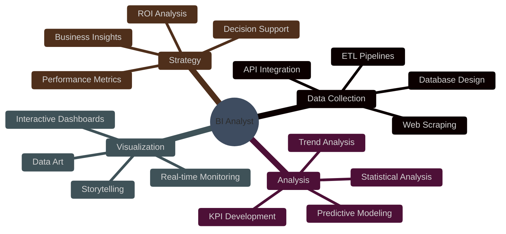

<div align="center">

```ascii
╔═══════════════════════════════════════════════════════════════════════════════╗
║                                                                               ║
║                   ███████╗███████╗███╗   ██╗██████╗ ██╗                      ║
║                   ██╔════╝██╔════╝████╗  ██║██╔══██╗██║                      ║
║                   █████╗  █████╗  ██╔██╗ ██║██████╔╝██║                      ║
║                   ██╔══╝  ██╔══╝  ██║╚██╗██║██╔══██╗██║                      ║
║                   ██║     ███████╗██║ ╚████║██║  ██║██║                      ║
║                   ╚═╝     ╚══════╝╚═╝  ╚═══╝╚═╝  ╚═╝╚═╝                      ║
║                                                                               ║
║                    ▓▓▓  DATA INTELLIGENCE ARCHITECT  ▓▓▓                     ║
║                 ══════════════════════════════════════════                    ║
║                  Transforming Data into Strategic Insights                   ║
╚═══════════════════════════════════════════════════════════════════════════════╝
```


</div>

##  **About Me | Sobre Mim**

```python
class SeniorBIAnalyst:
    def __init__(self):
        self.name = "Iramam Silva (Fenri Lunaedge)"
        self.role = "Senior Business Intelligence Analyst"
        self.company = "Samsung SDS"
        self.location = "🌎 São Paulo, Brazil"
        self.experience = "5+ years"
        self.education = "MBA in BI & Analytics @ USP (ongoing)"
        self.mindset = "Transforming Data into Strategic Insights"

    def professional_summary(self):
        return """
        Senior BI Analyst specializing in interactive dashboards, ETL
        orchestration, and NLP-powered analytics. Built enterprise-scale
        data pipelines and developed full-stack analytics platforms from
        scratch. Expert in Tableau, Pentaho, Apache Hop, and Python.
        """

    def current_focus(self):
        return {
            "at_work": [
                "Dashboards for LAO Public Relations (Tableau/Power BI)",
                "Brand monitoring with Python + SAP HANA/Vertica",
                "Full-stack NLP platform for social media analytics"
            ],
            "learning": [
                "Advanced Power BI + DAX",
                "Machine Learning for BI",
                "Cloud-native data architectures"
            ],
            "side_projects": [
                "Ultrathink - NLP automation platform (~35k LOC, Vue 3 + FastAPI)",
                "Real-time analytics dashboards",
                "Open-source BI tools exploration"
            ]
        }

    def tech_arsenal(self):
        return {
            "bi_platforms": ["Tableau ⭐", "Power BI", "Pentaho", "Knime"],
            "etl_orchestration": ["Apache Hop ⭐", "Pentaho DI", "Python pipelines"],
            "languages": ["SQL ⭐", "Python", "DAX"],
            "databases": ["SAP HANA", "Vertica", "Oracle", "SQL Server",
                          "MySQL/MariaDB", "PostgreSQL", "Progress OpenEdge"],
            "python_stack": ["FastAPI", "Pandas", "spaCy (NLP)", "SQLite",
                             "APScheduler", "PYGWalker", "openpyxl"],
            "frontend_stack": ["Vue 3", "Vite", "Pinia", "Chart.js"],
            "ai_nlp": ["Multi-language NLP (PT/EN/ES)", "Entity Detection",
                       "Sentiment Analysis", "Social Media Analytics"],
            "devops": ["Git", "Server Administration", "Performance Tuning"]
        }

    def achievements(self):
        return {
            "ultrathink_platform": {
                "description": "Full-stack NLP analytics automation",
                "scale": "~35,000 lines of code",
                "tech": "FastAPI + Vue 3 + Vite + spaCy + Pandas",
                "features": ["60+ API endpoints", "20 web interfaces",
                             "33+ Vue components", "16 customizable themes", "Async processing"]
            },
            "samsung_sds": "Dashboards & ETL for LAO Public Relations",
            "teresa_perez": "4.5 years managing BI infrastructure & ETL",
            "education": "MBA BI & Analytics @ USP + FATEC-SP degree"
        }

analyst = SeniorBIAnalyst()
print(f"{analyst.name}: {analyst.professional_summary()}")
```

<div align="center">

## 📊 **GitHub Analytics | Métricas em Tempo Real**


</div>

---

## 🛠️ **Tech Arsenal | Arsenal Tecnológico**

<div align="center">

### 📈 **Business Intelligence & Analytics**


### 💻 **Programming & Data Engineering**


### 🔄 **ETL & Data Orchestration**


### 🗄️ **Databases & Data Warehouses**


### 🎨 **Data Visualization**


### 🤖 **AI & Natural Language Processing**


### ☁️ **Infrastructure & DevOps**


</div>

---

## 🎯 **Expertise Matrix | Matriz de Especialização**

<div align="center">



</div>

---

## 🚀 **Featured Projects | Projetos em Destaque**

<div align="center">

### 🌟 **Ultrathink - Enterprise NLP Analytics Platform**

<table>
<tr>
<td width="60%">

**Full-stack platform for automated text analytics with NLP**

**📌 Key Highlights:**
- 🔥 **~35,000 lines of code** (Backend + Frontend)
- 🌐 **60+ REST API endpoints** (FastAPI async architecture)
- 🖥️ **20 complete web interfaces** with 16 customizable themes
- 🧩 **33+ reusable Vue components** (Design System)
- 🤖 **Multi-language NLP** (Portuguese, English, Spanish)
- 📊 **Integrated data explorer** (PYGWalker - Tableau-style)
- ⚡ **Async processing** with intelligent caching

**🛠️ Tech Stack:**
- **Backend:** Python, FastAPI, spaCy, Pandas, SQLite
- **NLP Engine:** Entity detection, sentiment analysis, keyword matching, irony/temporal detection
- **ETL:** Configurable pipelines, SAP HANA/Vertica connectors
- **Automation:** APScheduler (hourly/daily/weekly/cron)
- **Frontend:** Vue 3, Vite, Pinia, Chart.js (glassmorphism design)

**💡 Real-world Application:**
Built for Samsung SDS LAO Public Relations team to automate social media
and traditional media monitoring, processing thousands of text entries
and generating ready-to-use Excel reports with conditional formatting.

</td>
<td width="40%">

```ascii
┌─────────────────────┐
│  DATA SOURCES       │
├─────────────────────┤
│ • Excel/CSV Upload  │
│ • SAP HANA Queries  │
│ • Vertica DB        │
│ • Social Media      │
└──────────┬──────────┘
           │
           ▼
┌─────────────────────┐
│   NLP PROCESSOR     │
├─────────────────────┤
│ • Keyword Detection │
│ • Entity Resolution │
│ • Sentiment Analysis│
│ • Context Detection │
└──────────┬──────────┘
           │
           ▼
┌─────────────────────┐
│  ETL PIPELINE       │
├─────────────────────┤
│ • Data Mapping      │
│ • VLOOKUP/PROCV     │
│ • Multi-sheet Excel │
└──────────┬──────────┘
           │
           ▼
┌─────────────────────┐
│  OUTPUTS            │
├─────────────────────┤
│ • Excel Reports     │
│ • Interactive Viz   │
│ • Scheduled Jobs    │
│ • Email/Webhook     │
└─────────────────────┘
```

</td>
</tr>
</table>

---

### 📊 **Other Professional Projects**

<table>
<tr>
<td width="50%">

### 🏢 Samsung SDS - BI Dashboards
**Role:** Senior BI Analyst (2025 - Present)

**Stack:** Tableau, Power BI, Python, SAP HANA, Vertica
**Features:**
- Executive dashboards for LAO Public Relations
- Real-time brand monitoring and sentiment tracking
- Event analytics with multi-source data integration
- Automated reporting pipelines

</td>
<td width="50%">

### ✈️ Teresa Perez Tours - BI Infrastructure
**Role:** BI Analyst (2020 - 2025)

**Stack:** Tableau, Pentaho, Apache Hop, Oracle, MySQL, SQL Server
**Features:**
- Enterprise-wide dashboard management
- Complete ETL/DWH administration
- Server performance optimization
- Multi-department reporting systems

</td>
</tr>
</table>

</div>

---

## 📫 **Connect With Me | Conecte-se Comigo**

<div align="center">

[](https://fenri-lunaedge.github.io)
[](https://linkedin.com/in/iramamasilva)
[](mailto:jralencars@gmail.com)
[](https://github.com/Fenri-Lunaedge)

**📍 São Paulo, Brazil | 💼 Open to BI/Analytics opportunities**

</div>

---

## 📈 **Contribution Graph | Gráfico de Contribuições**

<div align="center">


</div>

---

## 💡 **Current Stats | Estatísticas Atuais**

<div align="center">


</div>

---

<div align="center">

### 💭 **Random Dev Quote | Citação Aleatória**


</div>

---

<div align="center">

```ascii
╔══════════════════════════════════════════════════════════════════════╗
║                                                                      ║
║  "In God we trust. All others must bring data." - W. Edwards Deming ║
║                                                                      ║
╚══════════════════════════════════════════════════════════════════════╝
```


**⭐ From [Fenri-Lunaedge](https://github.com/Fenri-Lunaedge) | Building the future with data**

</div>
